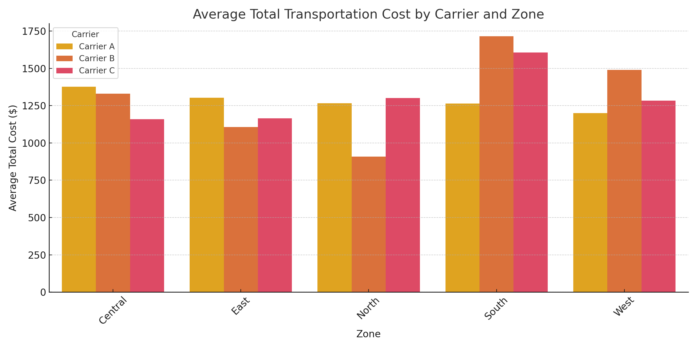

# UPS Transportation Cost Optimization Project

## Overview
This project analyzes logistics transportation costs to identify optimization opportunities by zone and carrier. The goal is to uncover hidden inefficiencies and provide actionable recommendations using data-driven insights.

## Tools Used
- Python (pandas, matplotlib, seaborn)
- SQL
- Power BI (future extension)
- Excel

## Dataset
- 100 records from a mock transportation log
- Fields: Date, Carrier, Zone, Distance (km), Fuel Surcharge, Base Cost, Total Cost

## Key Objectives
- Identify which zones have the highest average transportation cost
- Compare performance between carriers
- Suggest optimization strategies based on cost trends

## Key Insights
- Certain zones (like Central and West) show consistently higher costs
- Carrier C has a slightly higher average cost due to higher base rates

## Visualizations

## SQL Samples
See the `SQL Queries` folder for analysis scripts.

## Results & Recommendations
- Target Central and West zones for cost audits
- Consider renegotiating rates with Carrier C
- Investigate distance-cost relationships for routing optimization

## Author
**Prarthit Patel**  
[LinkedIn](https://linkedin.com/in/prarthit-patel)  
Business Analyst | Logistics & Data Enthusiast
